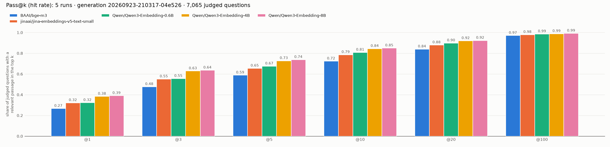

# SmolJur retrieval benchmark

Benchmarks embedding models on passage retrieval over Brazilian legal documents
(the Representative Redator v4 test set). For every question, each model ranks
the passages of the question's own document; the rankings are scored with the
[BEIR](https://github.com/beir-cellar/beir) evaluator plus MRR and Pass@k.

## Results

Generation `20260923-210317-04e526`: 871 documents, 65,145 passages, 7,065 judged
questions, top 100 per question. Full numbers are in
[`reports/v4/models-top100.json`](reports/v4/models-top100.json).

| Model | Pass@1 | Pass@5 | Pass@10 | Pass@20 | NDCG@10 | MRR@10 |
|---|---|---|---|---|---|---|
| Qwen/Qwen3-Embedding-4B | **0.383** | **0.727** | **0.844** | **0.920** | **0.520** | **0.530** |
| Qwen/Qwen3-Embedding-0.6B | 0.322 | 0.675 | 0.808 | 0.898 | 0.464 | 0.470 |
| jinaai/jina-embeddings-v5-text-small | 0.321 | 0.654 | 0.785 | 0.879 | 0.455 | 0.463 |
| BAAI/bge-m3 | 0.266 | 0.588 | 0.723 | 0.839 | 0.393 | 0.401 |



Pass@k is the share of judged questions with at least one relevant passage in
the top k. All metrics per cutoff: [`reports/v4/models-top100.png`](reports/v4/models-top100.png).

## Layout

| Path | Contents |
|---|---|
| `scripts/v4/` | The pipeline: dataset build (`run.py`), embedding client (`embeddings.py`), pgvector index (`index.py`, `pgvector_store.py`), ranking (`retrieve.py`), scoring (`metrics.py`), charts (`plots.py`). `manifest.py` lists every file that belongs to it. |
| `tests/v4/` | Tests, including a fake vLLM server and a synthetic two-row source (`fixtures/fixture-v4.csv`). |
| `runs/v4/`, `runs/v4.provenance/` | One ranking per model and the record of how it was made (model, index build, generation, cost). |
| `reports/v4/` | Comparison report and charts. |
| `examples/corejur/` | CoreJur pair conversion and a document-scoped evaluation with sentence-transformers. |
| `compose.yaml` | The local PostgreSQL/pgvector database. |

## Setup

```bash
python -m venv .venv && . .venv/bin/activate
pip install -r requirements-v4.txt
```

Put the local settings in a gitignored `.env` and load it into each shell:

```bash
# .env
V4_POSTGRES_PASSWORD=<generated>
V4_POSTGRES_DSN=postgresql://redator:<same password>@localhost:5432/redator_v4
V4_EMBEDDING_BASE_URL=http://127.0.0.1:8000/v1
# V4_EMBEDDING_API_KEY=...        only if the vLLM server requires one

set -a; . ./.env; set +a
docker compose up -d postgres
```

The source is the 1,000-row v4 test CSV (SHA-256
`d10d21f2074e48576cb715bc65ef01a36f369bf837dd2c404280775cef56fff3`); it is not
in Git. The build refuses any other file unless its fingerprint is passed
explicitly.

## Running the benchmark

**1. Build the dataset.** Writes an immutable `generations/<id>/` and points
`current` at it; a failed build leaves `current` unchanged.

```bash
python -m scripts.v4.run <v4-test.csv> datasets/redator_v4_test
```

**2. Serve a model.** Embeddings come from a trusted vLLM server, reached over
HTTPS or a loopback tunnel (e.g. `ssh -N -L 8000:127.0.0.1:8000 <gpu-host>`);
plain HTTP to any other host is refused. One server serves one model, under its
Hugging Face ID. Every model ran on vLLM 0.30.0 with `--runner pooling
--max-model-len 1024 --gpu-memory-utilization 0.85`, plus:

| Model | Dimension | Extra `vllm serve` flags | Text sent (added by the client) |
|---|---|---|---|
| `Qwen/Qwen3-Embedding-0.6B` (default) | 1024 | — | query: `Instruct: Retrieve the passage from the same legal document that answers the question.\nQuery:` + question |
| `Qwen/Qwen3-Embedding-4B` | 2560 | — | same as 0.6B |
| `jinaai/jina-embeddings-v5-text-small` | 1024 | `--trust-remote-code --hf-overrides '{"jina_task": "retrieval"}' --pooler-config '{"seq_pooling_type": "LAST"}'` | `Query: ` + question, `Document: ` + passage |
| `BAAI/bge-m3` | 1024 | `--pooler-config '{"seq_pooling_type": "CLS"}'` | question and passage unchanged |

Models are always stored at their full dimension. Adding a model means adding
an `EmbeddingModel` to `MODELS` in `scripts/v4/embeddings.py`. Jina v5 is
licensed CC BY-NC 4.0 (non-commercial).

**3. Index, rank, compare.**

```bash
python -m scripts.v4.index datasets/redator_v4_test --model <model-id>
python -m scripts.v4.retrieve datasets/redator_v4_test/current/beir runs/v4/<name>-top100.json \
  --top-k 100 --model <model-id>
python -m scripts.v4.metrics datasets/redator_v4_test/current/beir/qrels/test.tsv runs/v4 \
  --k-values 1 3 5 10 20 100 --output reports/v4/models-top100.json
python -m scripts.v4.plots reports/v4/models-top100.json reports/v4/models-top100.png
python -m scripts.v4.plots reports/v4/models-top100.json reports/v4/pass-top100.png --pass-comparison
```

Each model has its own active index per generation. A new index is activated
only after its row count, passage mapping and vector norms check out, so a
failed build never replaces a working one. Retrieval embeds only the
questions, ranks each one exactly (cosine) within its own document's passages,
and refuses an index built for other data, another model or other text
handling.

## Tests

```bash
python -m pytest tests/v4
```

Tests that need PostgreSQL use a throwaway database and skip when none is
reachable. `V4_REQUIRE_PGVECTOR=1` makes them mandatory and also runs a test
that **restarts the compose database**; don't use it while an index or
retrieval job is running.
