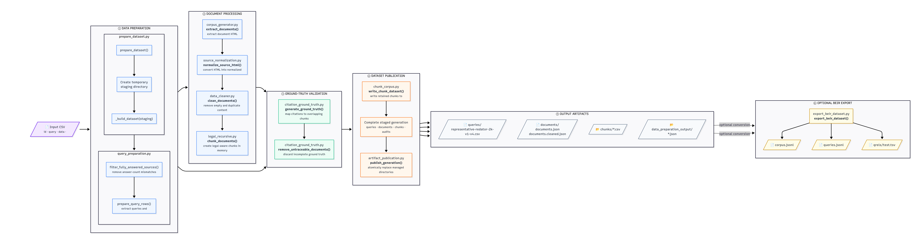

# Representative Redator Dataset Preparation Pipeline

## Purpose

This document is the technical reference for transforming
`representative_redator_test.csv` into the retrieval dataset under `data/`.
It describes the execution order, filtering rules, output schemas, current
statistics, removed source rows, and every JSON audit produced during data
preparation.

The pipeline is deterministic and does not call an external model or API.
Ground truth is derived from citations already present in the source
`output` column.

## Run the pipeline

Run the complete pipeline from the repository root:

```bash
python -m scripts.prepare_dataset representative_redator_test.csv data
```

The current default chunking configuration is:

| Setting | Value |
|---|---:|
| Maximum words | 400 |
| Target words | 300 |
| Overlap words | 50 |
| Minimum words | 50 |
| Strategy version | 2 |

The pipeline builds a complete generation outside the published data directory.
Only after every query, document, audit, and chunk has succeeded are
the managed artifact directories published. A failed build leaves the previous
generation intact; a failed publication is rolled back.

Individual files are also atomic: output is first written to a temporary file,
flushed, and then moved over the destination.

## Pipeline overview



The current reference run has the following stage counts:

```text
representative_redator_test.csv (99 rows)
  |
  +-- parse questions and source answers (619 candidate queries)
  |
  +-- remove answer-count mismatches
  |     13 documents removed
  |     86 documents / 512 queries remain
  |
  +-- extract HTML as normalized plain text
  |
  +-- clean documents and synchronize queries
  |     1 empty document and 5 queries removed
  |     85 documents / 507 queries remain
  |
  +-- create legal recursive chunks
  |
  +-- trace answer citations to overlapping chunks
  |
  +-- remove documents with incomplete ground truth
  |     13 documents and 148 queries removed
  |
  +-- persist the final dataset
        72 documents / 359 queries / 1,863 chunks
```

The orchestration interface is
[`prepare_dataset()`](../scripts/prepare_dataset.py). Its return value reports
the final query, document, and chunk counts plus both document-removal counts.

## Source dataset

Source: [`representative_redator_test.csv`](../representative_redator_test.csv)

The source contains 99 rows. The pipeline uses these columns directly:

| Column | Pipeline use |
|---|---|
| `id` | Stable document identifier |
| `query` | Prompt containing numbered natural-language questions |
| `data` | Original document HTML |
| `output` | JSON list of answer objects and citation IDs |
| Other columns | Preserved only in full removed-row audits |

Each source answer is expected to resemble:

```json
{
  "answer": "answer text",
  "citations": ["p-12", "p-13"]
}
```

## Stage 1: query preparation

Implementation:
[`query_preparation.py`](../scripts/query_preparation.py) and
[`query_spliter.py`](../scripts/query_spliter.py).

`prepare_query_rows()` performs the following operations in memory:

1. Finds sequential numbered questions.
2. Removes common answer-format instructions.
3. Normalizes whitespace.
4. Assigns stable source metadata.
5. Maps each question to its answer by zero-based answer index.
6. Copies the answer's source citations into the query row.

The initial 99 source rows produce 619 candidate query rows.

### Query identity

A query remains connected to its source through:

| Field | Meaning |
|---|---|
| `source_row` | Zero-based row index in the original CSV |
| `source_id` | Original document `id` |
| `source_query_number` | Number written before the source question |
| `source_answer_index` | Zero-based index into the source `output` list |

## Stage 2: answer-completeness filtering

Implementation:
`filter_fully_answered_sources()` in
[`query_preparation.py`](../scripts/query_preparation.py).

The function counts questions without using the answer list as a cap, then
compares that count with the number of objects in `output`. If the counts
differ, the entire source document and all its queries are excluded.

Result:

| Metric | Count |
|---|---:|
| Source documents evaluated | 99 |
| Documents removed | 13 |
| Documents retained | 86 |
| Candidate queries retained | 512 |

The full original rows are stored in
[`remove_incomplete_documents.json`](../data/data_preparation_output/remove_incomplete_documents.json).

## Stage 3: document extraction

Implementation:
[`source_normalization.py`](../scripts/source_normalization.py) and
[`corpus_generator.py`](../scripts/corpus_generator.py).

Source HTML is parsed once by the authoritative normalization module. The same
normalized text and citation spans feed corpus extraction and citation-derived
ground truth, preventing whitespace rules from drifting between those stages.

`extract_documents()`:

1. Reads the source `data` HTML.
2. Converts block-level elements to line breaks.
3. Removes markup while retaining text.
4. Collapses horizontal whitespace.
5. Emits records with `document_id` and `text`.

Intermediate output:
[`documents.json`](../data/documents/documents.json).

This intermediate currently contains 73 records: 86 answer-complete documents
minus the 13 documents later rejected for incomplete ground truth. The empty
document rejected during cleaning remains represented only in this
intermediate file. The final retrieval corpus uses
`documents.cleaned.json`, not this file.

## Stage 4: document cleaning

Implementation: [`data_cleaner.py`](../scripts/data_cleaner.py).

Cleaning runs in dependency-safe order:

1. Remove leading query prompts accidentally included in document text.
2. Remove embedded Base64 images.
3. Remove Unicode replacement characters.
4. Correct malformed or bare URLs.
5. Remove empty documents and their associated queries.
6. Remove duplicate documents having identical text and ordered queries.

Current cleaning results:

| Operation | Affected records |
|---|---:|
| Leading prompts removed | 1 |
| Encoded images removed | 2 |
| Unicode replacement characters removed | 1 |
| Documents with URL corrections | 26 |
| Empty documents removed | 1 |
| Queries removed with empty document | 5 |
| Duplicate documents removed | 0 |

The cleaning stage reduces the dataset from 86 to 85 documents and from 512 to
507 queries.

## Stage 5: legal recursive chunking

Implementation:
[`legal_recursive.py`](../scripts/strategies/chunking/legal_recursive.py) and
[`chunk_corpus.py`](../scripts/chunk_corpus.py).

The strategy:

- recognizes legal headings and sections;
- treats page separators as hard breaks;
- preserves tables and repeats table headers when splitting;
- targets 300 words per chunk;
- limits chunks to 400 words;
- retains 50 words of overlap;
- merges undersized tails where safe;
- stores source character offsets.

### Chunk schema

Each per-document CSV under [`data/chunks/`](../data/chunks/) contains:

| Column | Meaning |
|---|---|
| `chunk_id` | Stable ID containing document, strategy version, index, and offsets |
| `document_id` | Source document ID |
| `chunk_index` | Zero-based order within the document |
| `text` | Plain-text chunk |
| `word_count` | Whitespace-delimited word count |
| `start_offset` | Inclusive offset in cleaned document text |
| `end_offset` | Exclusive offset in cleaned document text |
| `section` | Detected legal section context |
| `chunk_type` | Prose, table, or mixed content |

The authoritative configuration and counts are stored in
[`manifest.json`](../data/chunks/manifest.json).

## Stage 6: citation-derived ground truth

Implementation:
[`citation_ground_truth.py`](../scripts/citation_ground_truth.py).

`generate_ground_truth()` maps each answer to chunks as follows:

1. Read the answer at `source_answer_index` from the original `output`.
2. Read every citation ID from that answer.
3. Find the cited HTML element and normalize its text.
4. Locate that text in the cleaned document.
5. Compensate for minor URL normalization through anchored text alignment.
6. Select every chunk whose character range overlaps the citation range.
7. Store the ordered chunk IDs as JSON in `relevant_chunks`.

No model-generated relevance judgment is used.

### Final query schema

Final output:
[`representative-redator-2k-v1-v4.csv`](../data/queries/representative-redator-2k-v1-v4.csv).

| Column | Meaning |
|---|---|
| `source_row` | Original CSV row index |
| `source_id` | Document ID |
| `source_query_number` | Original question number |
| `source_answer_index` | Answer index in original `output` |
| `query` | Normalized natural-language query |
| `citations` | JSON list of original HTML citation IDs |
| `relevant_chunks` | JSON list of overlapping chunk IDs |

## Stage 7: incomplete-ground-truth filtering

Implementation:
`remove_untraceable_documents()` in
[`citation_ground_truth.py`](../scripts/citation_ground_truth.py).

If any query has no relevant chunk, either because its answer has no citations
or because a cited ID cannot be associated with source HTML text, the entire
document, all its queries, and all its generated CSV artifacts are removed.
This prevents partially labeled document groups from entering the benchmark.

Thirteen documents and 148 queries are removed by this rule. Their full original
rows and mapping failures are stored in
[`remove_untraceable_citations.json`](../data/data_preparation_output/remove_untraceable_citations.json).

The individual mapping failures remain available in
[`unmapped_citations.json`](../data/data_preparation_output/unmapped_citations.json).
They describe rejected documents and are not present in the final corpus.

## Final dataset statistics

These values were verified from the current files on disk.

| Metric | Count |
|---|---:|
| Original source rows | 99 |
| Final documents | 72 |
| Final queries | 359 |
| Final chunks | 1,863 |
| Queries with source citations | 359 |
| Queries with relevant chunks | 359 |
| Queries whose answers contain no citations | 0 |
| Query-to-chunk relevance links | 2,230 |
| Unique chunks referenced as relevant | 501 |

All non-empty `relevant_chunks` values were validated against the current
chunk CSV files.

## Data-preparation JSON reference

Directory:
[`data/data_preparation_output/`](../data/data_preparation_output/).

| File | Records | Contents |
|---|---:|---|
| [`check_documents_with_prompt.json`](../data/data_preparation_output/check_documents_with_prompt.json) | 1 | Removed leading prompt, original text, and character count |
| [`check_empty_documents.json`](../data/data_preparation_output/check_empty_documents.json) | 1 | Empty document plus its five removed queries |
| [`correct_url.json`](../data/data_preparation_output/correct_url.json) | 26 | URL corrections with before/after values |
| [`deduplicate_documents.json`](../data/data_preparation_output/deduplicate_documents.json) | 0 | Duplicate-removal audit; no duplicates found |
| [`remove_encode_images.json`](../data/data_preparation_output/remove_encode_images.json) | 2 | Removed Base64 image counts and sizes |
| [`remove_incomplete_documents.json`](../data/data_preparation_output/remove_incomplete_documents.json) | 13 | Complete original rows rejected by answer-count validation |
| [`remove_unicode.json`](../data/data_preparation_output/remove_unicode.json) | 1 | Unicode replacement-character removal |
| [`remove_untraceable_citations.json`](../data/data_preparation_output/remove_untraceable_citations.json) | 13 | Complete original rows rejected for incomplete ground truth |
| [`unmapped_citations.json`](../data/data_preparation_output/unmapped_citations.json) | 66 | Individual citation mapping failures among the rejected documents |

### Audit record shapes

Completeness removal:

```json
{
  "source_row": 1,
  "reason": "answer_count_does_not_match_query_count",
  "row": {
    "id": "...",
    "query": "...",
    "data": "...",
    "output": "..."
  }
}
```

Incomplete-ground-truth removal:

```json
{
  "source_row": 5,
  "reason": "document_has_incomplete_ground_truth",
  "unmapped_citations": [
    {
      "document_id": "...",
      "citation": "p-01",
      "reason": "citation_element_not_found"
    }
  ],
  "queries_without_relevant_chunks": [
    {
      "source_query_number": "1",
      "query": "...",
      "citations": "[]"
    }
  ],
  "row": {
    "id": "...",
    "query": "...",
    "data": "...",
    "output": "..."
  }
}
```

The `row` object includes every original CSV column. Large `data` HTML is
kept in the JSON audit instead of duplicated in this Markdown report.

## Real examples by filter

The excerpts below come from the source CSV or the extracted document text.
They are intentionally short; the linked audit records retain the complete
source rows and transformation metadata.

### Answer-count validation: document removed

Document `019cbf04-aa82-7811-9b4b-f08cd45933fd` was extracted successfully
and begins with this text:

```text
Tipo documento: CAPA PROCESSO
Evento: abertura
PROCESSO
Nº 5005145-88.2025.8.21.0074
Classe da ação: PROCEDIMENTO COMUM CÍVEL
Órgão Julgador:
Juízo da 1ª Vara Judicial da Comarca de Três de Maio
```

It was removed because the source row contains 25 queries but only 24 answer
objects. The document text itself was not defective; its query group was
incomplete. See source row 1 in
[`remove_incomplete_documents.json`](../data/data_preparation_output/remove_incomplete_documents.json).

### Leading-prompt check: text rewritten

Document `019d7eec-f3bc-72a1-a281-1a301f81f06a` originally started with:

```text
**Analise os documentos e responda a pergunta.**
Fls.: 1
Poder Judiciário
Justiça do Trabalho
Tribunal Regional do Trabalho da 2ª Região
```

The first line is an instruction to a model, not legal-document content. The
filter removed those 49 leading characters. The cleaned document starts with:

```text
Fls.: 1
Poder Judiciário
Justiça do Trabalho
Tribunal Regional do Trabalho da 2ª Região
```

See [`check_documents_with_prompt.json`](../data/data_preparation_output/check_documents_with_prompt.json).

### Encoded-image removal: text rewritten

Document `019d4001-e624-7c71-a08d-008d8605817e` contained two inline images.
One real payload begins immediately after the document-validation text:

```text
Número do documento: 26032709140222500000451816798
data:image/jpeg;base64,/9j/4AAQSkZJRgABAQAAAQABAAD/2wBDAAgGBgcG...
```

The `data:image/jpeg;base64,...` payload is image data rather than searchable
legal prose. Removing both payloads reduced the extracted text from 35,045 to
6,603 characters, a reduction of 28,442 characters. The surrounding legal
text, including the process and document numbers above, was retained. See
[`remove_encode_images.json`](../data/data_preparation_output/remove_encode_images.json).

### Unicode replacement-character removal: text rewritten

Document `019d1a70-6772-7a53-b0db-596b93b27bdf` contained two Unicode
replacement characters. The affected real text was:

```text
Localizador(es): DECURSO DE PRAZO - � (C) - Malote Digital � Ajuda localizadores:
```

The replacement character `�` indicates undecodable input and carries no
recoverable content. The cleaned text is:

```text
Localizador(es): DECURSO DE PRAZO -  (C) - Malote Digital  Ajuda localizadores:
```

See [`remove_unicode.json`](../data/data_preparation_output/remove_unicode.json).

### URL correction: text rewritten

Document `019dcf15-a0d3-78d1-893a-d0a127e547f3` included this real contact
line:

```text
tel.: +55 11 4550-1620 – contato@pereirapulici.com.br www.pereirapulici.com.br
```

Because the URL had no scheme, the filter changed it to:

```text
tel.: +55 11 4550-1620 – contato@pereirapulici.com.br https://www.pereirapulici.com.br
```

The same document also changed `www.factafinanceira.com.br` to
`https://www.factafinanceira.com.br`. See
[`correct_url.json`](../data/data_preparation_output/correct_url.json).

### Empty-document check: document and queries removed

Document `019cba61-9b16-7f83-bb1d-40f523a83986` originally consisted of an
encoded image payload. After the encoded-image filter removed that
non-searchable payload, its remaining document text was empty:

```text
""
```

There was therefore no searchable text for its five queries. Removed queries
included:

```text
Indique se há condição insalubre,
Indique se há acordo arbitral,
Indique se havia refeitório,
```

The document and all five queries were removed together. See
[`check_empty_documents.json`](../data/data_preparation_output/check_empty_documents.json).

### Deduplication: no document changed

The deduplication filter compared document text and query groups, but the
current run found no duplicates. Consequently there is no removed or rewritten
document example for this filter, and
[`deduplicate_documents.json`](../data/data_preparation_output/deduplicate_documents.json)
is an empty JSON list.

### Missing answer evidence: document removed

Document `019c9014-8559-7a11-b870-05d3dc9f5ef0` contains real searchable text,
including:

```text
EXMO. SR. DR. JUIZ DE DIREITO DO JUIZADO ESPECIAL CÍVEL
DA COMARCA DE TRÊS RIOS/RJ
LENI BORGES DE OLIVEIRA SILVA [...] vem, por sua procuradora,
propor AÇÃO DE REPARAÇÃO POR DANOS MORAIS em face de BANCO SANTANDER
```

However, its first answer entry is:

```json
{
  "answer": null,
  "citations": []
}
```

The query asks for the passage supporting an urgent or preliminary injunction.
Although an answer object occupies the expected list position, it contains
neither an answer nor evidence. With no citation to trace, the query has no
relevant chunk, so the entire document group was removed.

A second real form appears in document
`019d9c14-ea05-7cf3-9fbc-19ef3cc58cd3`, query 3:

```json
{
  "answer": "Não",
  "citations": []
}
```

No source entry combines `"answer": "Sim"` with an empty citation list. Both
examples are recorded in
[`remove_untraceable_citations.json`](../data/data_preparation_output/remove_untraceable_citations.json).

### Untraceable citation: document removed

Document `019dcf15-a0d3-78d1-893a-d0a127e547f3` begins with real legal text:

```text
Goiânia – GO
EXCELENTÍSSIMO(A) SENHOR(A) DOUTOR(A) JUIZ(A)
DE DIREITO DA COMARCA DE GOIÂNIA-GO
VASCO PEREIRA DA SILVA, brasileiro, viúvo, pensionista [...]
```

Its answers cite IDs such as `p-01`, but the original HTML contains no element
with that ID. A representative failure is:

```json
{
  "source_query_number": "1",
  "citation": "p-01",
  "reason": "citation_element_not_found"
}
```

Because the citation cannot be associated with any span and therefore any
chunk, the document and all its queries were removed. See
[`unmapped_citations.json`](../data/data_preparation_output/unmapped_citations.json)
and [`remove_untraceable_citations.json`](../data/data_preparation_output/remove_untraceable_citations.json).

## Removed source rows

### Answer-count mismatch

Full records:
[`remove_incomplete_documents.json`](../data/data_preparation_output/remove_incomplete_documents.json).

| Source row | Document ID | Questions | Answers |
|---:|---|---:|---:|
| 1 | `019cbf04-aa82-7811-9b4b-f08cd45933fd` | 25 | 24 |
| 14 | `019f2a5e-573d-7052-93da-d06a0bfcc248` | 1 | 0 |
| 28 | `019cbff3-c127-72d0-8ffd-5aa62318c5fc` | 5 | 1 |
| 30 | `019c8af5-b37f-7df3-8d75-792befc475c4` | 4 | 5 |
| 31 | `019cb51e-c841-75e3-98c6-506d70b96d00` | 0 | 1 |
| 39 | `019ce3a9-2de7-71c0-b626-991f55a8ae4c` | 5 | 2 |
| 58 | `019f24b5-4c75-7633-92ca-d86d90105209` | 7 | 0 |
| 61 | `019f0482-6a7a-7ac2-8100-a6c403798810` | 22 | 0 |
| 67 | `019c90bd-57c7-7471-8302-bab359dfb78f` | 1 | 0 |
| 68 | `019f1a21-52b6-7cf2-b096-fc7cba170bd4` | 6 | 0 |
| 78 | `019f2819-06ee-7e01-a0c6-18fd8d6ef6b9` | 17 | 0 |
| 82 | `019f1e24-d6d6-7260-a106-3799f0f2b5f1` | 12 | 0 |
| 88 | `019edac7-df47-71c2-a0b1-470ea671a315` | 10 | 0 |

### Incomplete ground truth

Full records:
[`remove_untraceable_citations.json`](../data/data_preparation_output/remove_untraceable_citations.json).

| Source row | Document ID | Unmapped references | Queries without relevant chunks |
|---:|---|---:|---:|
| 5 | `019dcf15-a0d3-78d1-893a-d0a127e547f3` | 18 | 15 |
| 7 | `019dd70f-68ef-7ff2-89f4-b1e84f09f6b2` | 20 | 9 |
| 12 | `019c9014-8559-7a11-b870-05d3dc9f5ef0` | 0 | 12 |
| 20 | `019dc6a6-18a3-72d2-99c7-5d30c03259c9` | 0 | 3 |
| 21 | `019eccb3-2a5a-7852-9ae7-af943b04de58` | 0 | 1 |
| 34 | `019d9c14-ea05-7cf3-9fbc-19ef3cc58cd3` | 0 | 3 |
| 41 | `019d1a70-6772-7a53-b0db-596b93b27bdf` | 27 | 10 |
| 46 | `019d6e41-fdb9-7492-a4ec-a744abbccec7` | 0 | 1 |
| 47 | `019f384c-3346-7fb0-9bcd-eab684fbd051` | 0 | 1 |
| 72 | `019cbeb1-403a-7593-b83d-85e15dc73dbb` | 1 | 0 |
| 79 | `019d55d0-30f2-7621-b7fb-732640813d37` | 0 | 1 |
| 93 | `019f1ec0-ea12-7033-a94a-c7fdaf47eef8` | 0 | 1 |
| 97 | `019f2406-6ade-7e52-8612-47e1afdc77ad` | 0 | 3 |

Rows with unmapped references contain cited IDs that do not resolve to usable
HTML elements. Rows with zero unmapped references were rejected because at
least one answer supplied no citations. For example, source row 5 contains
only the outer `docViewer` ID and flattens the document into one
`<pre><code>` block; it contains neither `p-01` nor `p-1`.

## Validation invariants

A successful pipeline run must satisfy all of the following:

- every final query references a final document;
- every non-empty `relevant_chunks` ID exists in a current chunk CSV;
- every final document has a chunk CSV;
- no answer-count-rejected document appears in final queries or documents;
- no incomplete-ground-truth document appears in final queries or documents;
- every final query has at least one relevant chunk;
- no rejected document retains a stale per-document CSV;
- the chunk manifest counts match the persisted files;
- audit JSON contains the complete original rows for every document-level
  rejection.

## Known limitations

### Flattened source documents

Citation tracing requires HTML element IDs or enough retained structure to
locate cited text. Documents flattened into a single `<pre><code>` block
cannot recover paragraph or page IDs that were lost before this pipeline.

### Intermediate raw document count

`documents.json` is an intermediate extraction artifact and can contain a
record subsequently removed as empty. Consumers should use
`documents.cleaned.json` and the chunk manifest as the final corpus.

## Relevant implementation files

- [`prepare_dataset.py`](../scripts/prepare_dataset.py): orchestration and
  final artifact consistency
- [`query_preparation.py`](../scripts/query_preparation.py): question
  extraction and answer-completeness filtering
- [`corpus_generator.py`](../scripts/corpus_generator.py): HTML-to-text
  document extraction
- [`data_cleaner.py`](../scripts/data_cleaner.py): cleaning and cleaning
  audits
- [`legal_recursive.py`](../scripts/strategies/chunking/legal_recursive.py):
  chunking strategy
- [`chunk_corpus.py`](../scripts/chunk_corpus.py): chunk and manifest
  persistence
- [`citation_ground_truth.py`](../scripts/citation_ground_truth.py):
  citation-to-chunk mapping and traceability filtering
- [`persistence.py`](../scripts/persistence.py): atomic JSON and CSV writes
